# Authentication - Java Lecture Notes

In this lecture, you'll continue working with the hotel reservation API server and client application. You'll focus on adding authentication and authorization to both.

## Running the application

First, open both the Reservations client and server applications into separate IntelliJ windows. It is always a good practice to make sure everything works, applications run, before adding any new code.

## Login endpoint

With the server application running, open Postman and test the login endpoint. Do this my making a `POST` request to `https://localhost:8080/login` and use the following JSON as the request body. Remember to set body type to "Raw" and "JSON":

```json
{
	"username": "user",
	"password": "password"
}
```

Next, take a close look at the response received from the request. Note: Your "token" value will be slightly different than the screenshot. 

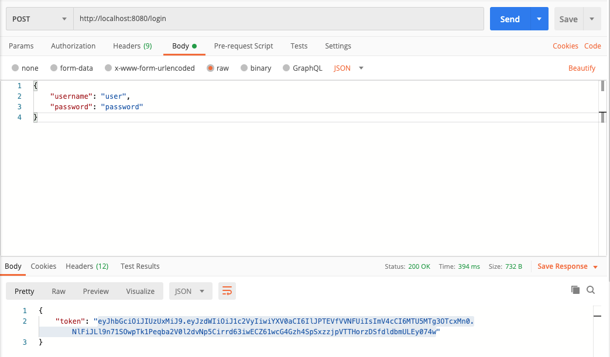

> Keep the login tab open—you'll reuse it later in the lecture.

What you've done so far is "authentication", which is the process of validating that users are who they claim to be. You authenticated with a username and password; authentication can come in many different forms, such as fingerprints and personal identification numbers (PINs).

Now that you received a response with this token, what is it exactly?

## JWT

JSON Web Tokens (JWT) Highlights:

- Their compact size allows for quick transfer with requests.
- They're often used as authorization mechanisms, storing user info such as their permissions or roles. These are called "claims."
  - They can contain any data that can be represented in JSON.
- JWT actually contains JSON, but it's encoded.

Copy the token value from the Postman response, open [JWT decoder](https://jwt.io/#debugger-io), and paste in the token on the "Encoded" side, paying attention to the color-coding of the payload section in particular:

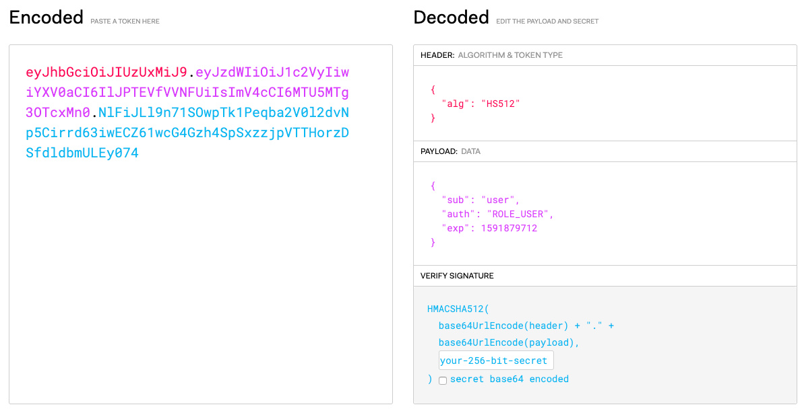

You'll see claims such as `sub`, `auth`, and `exp` which stand for:

- `sub`  = "Subject"
- `auth` = "Authorities(Roles)"
- `exp`  = "Expires"

Timestamps are stored in "Unix time", which is the number of seconds since `01-01-1970 00:00:00 UTC`. Unix time is preferred because it can be represented by a number, without concern for format or timezones.

If you hover over any field name—except "auth"—and it shows you what the field name stands for:

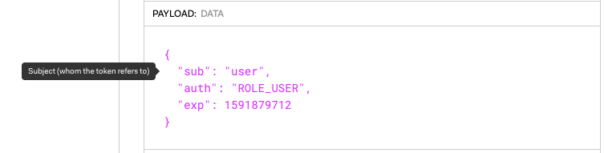

If you hover over a Unix timestamp, it shows you the time in a human-readable format, including your timezone:

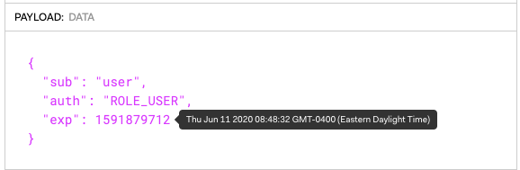

## Setting authorization rules

"Authorization" is the process of giving a user permission to access a specific resource or function. Now we can move back to the Server project in IntelliJ for the next examples. We are going to assume the authorization rule is as follows: anyone that's authenticated—meaning they have a valid JWT token—is authorized to access the resource.

Start the server again if it's not already running. Before adding any authorization rules, try the `/hotels` and `/hotels/{id}` endpoints  in Postman. It retrieves data like before.

Stop the server and open `HotelController.java`. Add the `@PreAuthorize("isAuthenticated()")` annotation to the `get()` method. The annotation order doesn't matter:

```java
@PreAuthorize("isAuthenticated()")
@RequestMapping(path = "/hotels/{id}", method = RequestMethod.GET)
public Hotel get(@PathVariable int id) {
    return hotelDao.get(id);
}
```

> Note: Spring Expression Language (SpEL) is briefly mentioned in the student book. If you want to look at some common expressions, you can find them at https://docs.spring.io/spring-security/site/docs/current/reference/html5/#el-common-built-in.
>
> This link is also in the student book, you are encouraged to focus on learning these common expressions.

Start the server again and try to request the `/hotels` and `/hotels/{id}` endpoints again. The `/hotels` method still works, but the `/hotels/{id}` endpoint results in a `401 Unauthorized` response:

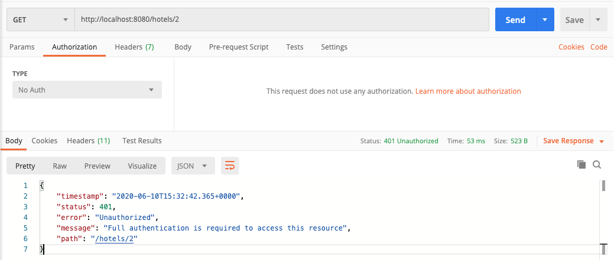

Now,because no authorization credentials were sent, the server responded with a `401` code.

To solve this problem, You can use the token that Postman returned above, if you want. If not, make another `POST` request to `https://localhost:8080/login` with the test username and password (user/password) to retrieve a new token.

In Postman, open the "Authorization" tab in the request, change the "Type" dropdown to "Bearer Token", and paste the token in the "Token" field. After you send the request, it returns the data with a `200 OK` response code:

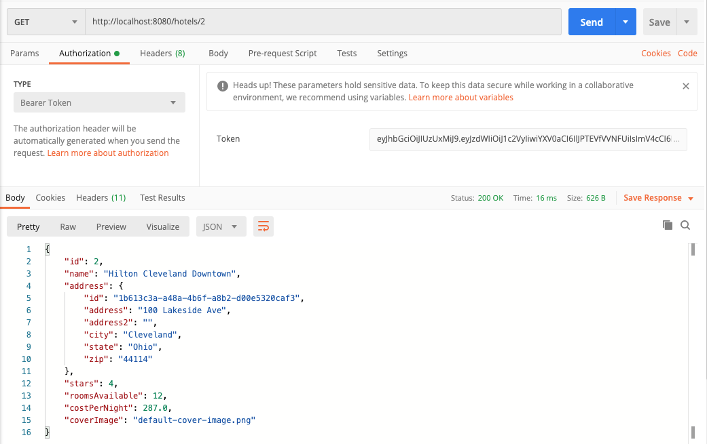

If you want to show there's no trickery, you can switch the "Type" dropdown back to "No Auth" and you'll receive a `401` again.

You can also see that the token is truly passed in the `Authorization` HTTP header by switching to the "Headers" tab in Postman:

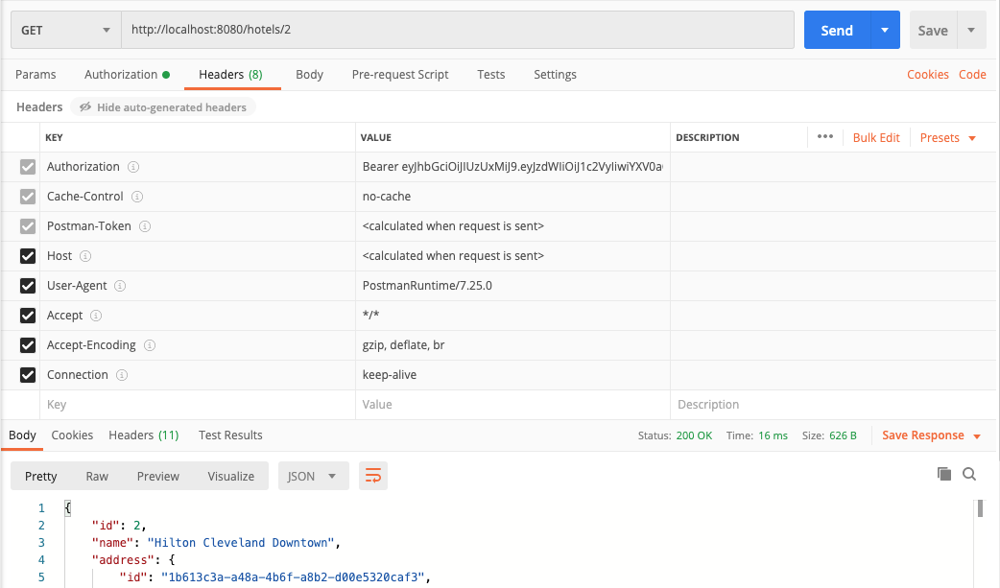

If you don't see the "Authorization" key, click on the "hidden" text to right of the "Headers" label to reveal all header key-value pairs.

Next, try moving the `@PreAuthorize("isAuthenticated()")` annotation from the method to the class:

```java
@RestController
@PreAuthorize("isAuthenticated()")
public class HotelController {

}
```

Start the server again and show in Postman that requests to both `/hotels` and `/hotels/{id}` endpoints now require authorization. In fact, all methods in the controller now require authorization.

### Anonymous access

Placing the attribute on the class level is useful if you know that an authorization rule applies to all methods in a class. However, there may be times where you want a class-level rule like that, but you want to override it for a particular method.

Imagine that you want authorization on all methods, except the `/hotels` endpoint. To override the class-level rule and allow anonymous—that is, not authenticated—access to the method, add the `@PreAuthorize("permitAll")` annotation to the `list()` method:

```java
@PreAuthorize("permitAll")
@RequestMapping(path = "/hotels", method = RequestMethod.GET)
public List<Hotel> list() {
    return hotelDao.list();
}
```

Run the server and return to Postman. In the request to `/hotels`, set the authorization type dropdown to "No Auth." The request now returns data again. See that adding an ID, such as `/hotels/2`, without authorization won't work and returns a `401`.

### Role based authorization

It's not uncommon to have certain resources or functions only be accessible to certain people or roles. In the case of the hotel reservation application, perhaps only admins can delete a reservation.

First, check that the endpoints work with the token you've been using. Make a `GET` request to the `/reservations` endpoint:

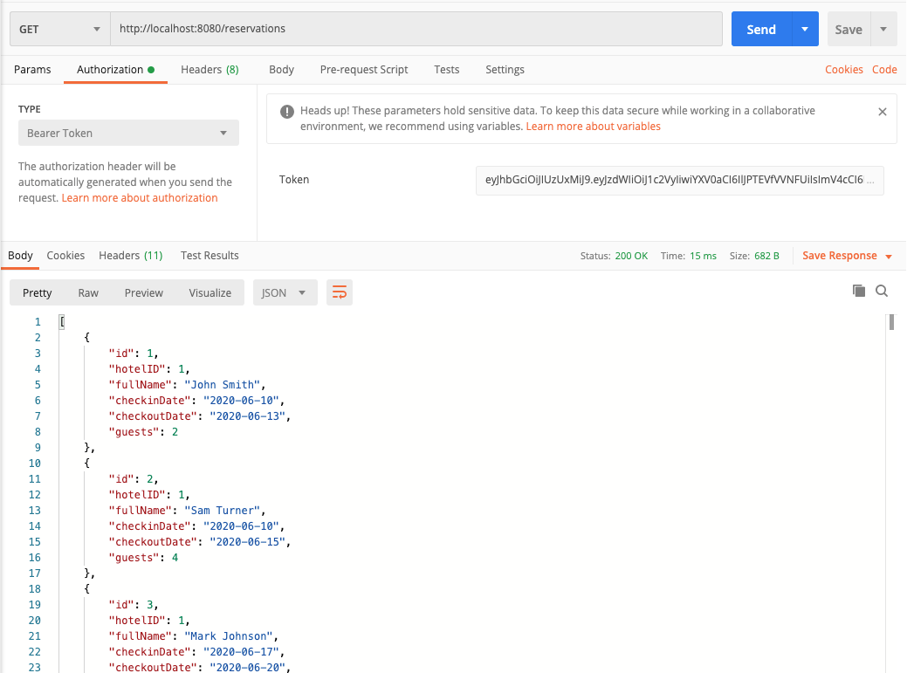

Then, make a `DELETE` request to `/reservations/{id}` with a valid ID of one of the reservations, such as `/reservations/1`. You'll receive a successful `204 No Content` response:

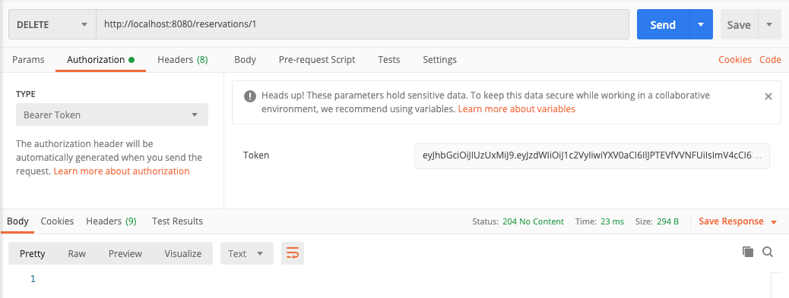

> You can perform a `GET` request again to see that it was deleted. NOTE: All data resets when you restart the application.

Return to `HotelController.java` and find the `delete()` method towards the bottom of the class. Add the `@PreAuthorize("hasRole('ADMIN')")` annotation to the method:

```java
@PreAuthorize("hasRole('ADMIN')")
@ResponseStatus(HttpStatus.NO_CONTENT)
@RequestMapping(path = "/reservations/{id}", method = RequestMethod.DELETE)
public void delete(@PathVariable int id) throws ReservationNotFoundException {
    reservationDao.delete(id);
}
```

This annotation means only users with the "ADMIN" role can access this resource. If you perform the same `DELETE` request in Postman, you'll receive a `403 Forbidden` response:

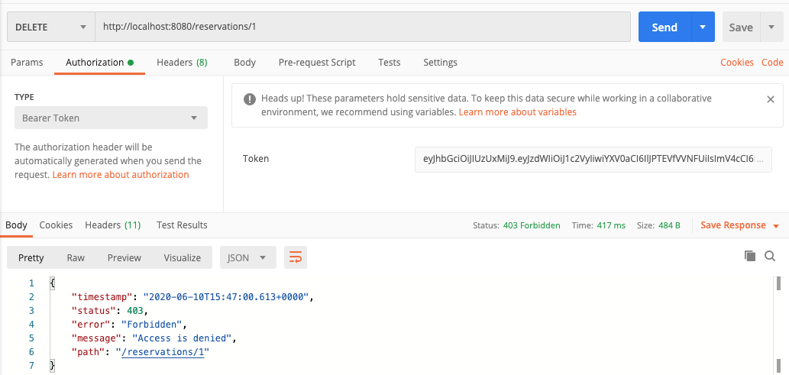

Because the authorization credentials, token, we created don't have the admin role, they could only access the list endpoint. You can see this role defined by decoding the JWT or login response in jwt.io's tool.

Return to the login request tab, and change the credentials to admin/admin:

```json
{
	"username": "admin",
	"password": "admin"
}
```

Send the request and you'll receive a new token:

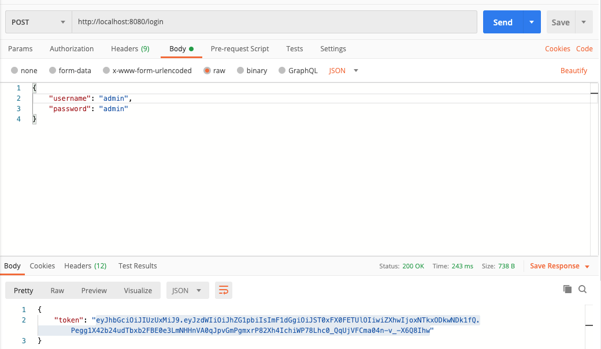

Copy and paste the new token into the `DELETE` request, and now it succeeds.


### Getting the current user

There are times where you'll need access to the current logged in user. You have secured the `delete()` method to users with the role `ADMIN`, but what if you wanted to keep an audit log of which user deleted each reservation?

In the `HotelController`, there's a private method called `auditLog()` that logs the operation that was executed, the ID of the reservation, and the username of the logged in user that performed the operation:

```java
private void auditLog(String operation, int reservation, String username) {
    System.out.println("User: " + username + "performed the operation: " + operation + "on reservation: " + reservation);
}
```

You need access to the current logged in user, and Spring gives you that access in your controller methods. If you add a new argument to the method that's of type `Principal`, Spring automatically resolves the argument for you:

```java
@PreAuthorize("hasRole('ADMIN')")
@ResponseStatus(HttpStatus.NO_CONTENT)
@RequestMapping(path = "/reservations/{id}", method = RequestMethod.DELETE)
public void delete(@PathVariable int id, Principal principal) throws ReservationNotFoundException {
    auditLog("delete",id,principal.getName());
    reservationDao.delete(id);
}
```

There are several things to consider in this code.

First, the term `Principal` in computer security is an entity that can be authenticated by a computer system or network. You can think of the `Principal` as the current user. Once you have the `Principal`, you can call `getName()` to get the username of the current logged in user.

The second thing to understand is how this happens. When you annotate a method with `@RequestMapping`, that method assumes a flexible signature thanks to the Spring Framework and allows you to choose from a range of Spring supported controller method arguments.

The following link has a list of arguments you can declare, and Spring resolves them for you: https://docs.spring.io/spring/docs/current/spring-framework-reference/web.html#mvc-ann-methods.

## Client code

Now let's switch over to the client code in the `client` project. If you open `App.java`, you'll find menu option #6 that calls `authenticationService.login`:

```java
} else if (menuSelection == 6) {
    String credentials = consoleService.promptForLogin();
    if( credentials.split(",").length == 2 ) {
        ResponseEntity<Map> response = authenticationService.login(credentials);
        if (response.hasBody()) {
            String token = (String) response.getBody().get("token");
            hotelService.AUTH_TOKEN = token;
            System.out.println("Login Successful");
        }
    } else {
        consoleService.printError("Please enter username and password separated by a comma.");
    }
}
```

This functionality is provided by a new class called `AuthenticationService.java`. Open `AuthenticationService`, if you walk through the `login()` method. It looks like a typical `POST` request:

```java
public ResponseEntity<Map> login(String credentials) throws AuthenticationServiceException {
    LoginDTO loginDTO = new LoginDTO(credentials);
    HttpHeaders headers = new HttpHeaders();
    headers.setContentType(MediaType.APPLICATION_JSON);
    HttpEntity<LoginDTO> entity = new HttpEntity<>(loginDTO, headers);
    ResponseEntity<Map> response = null;
    try {
        response = restTemplate.exchange(BASE_URL + "/login", HttpMethod.POST, entity, Map.class);
    } catch(RestClientResponseException ex) {
        if (ex.getRawStatusCode() == 401 && ex.getResponseBodyAsString().length() == 0) {
            String message = ex.getRawStatusCode() + " : {\"timestamp\":\"" + LocalDateTime.now() + "+00:00\",\"status\":401,\"error\":\"Invalid credentials\",\"message\":\"Login failed: Invalid username or password\",\"path\":\"/login\"}";
            throw new AuthenticationServiceException(message);
        }
        else {
            String message = ex.getRawStatusCode() + " : " + ex.getResponseBodyAsString();
            throw new AuthenticationServiceException(message);
        }
    }
    return response;
}
```

A `LoginDTO` class has also been defined. This class has a username and password field that you can use to send credentials to the server. The username and password is serialized into a JSON object as part of the request body.

A new `HttpHeaders` instance allows you to set the content type of the request to `application/json`. Using the request body and headers, you can create a `HttpEntity` that's sent in the request:

```java
LoginDTO loginDTO = new LoginDTO(credentials);
HttpHeaders headers = new HttpHeaders();
headers.setContentType(MediaType.APPLICATION_JSON);
HttpEntity<LoginDTO> entity = new HttpEntity<>(loginDTO, headers);
```

Now that you have an `HttpEntity`, you can use the `RestTemplate` `exchange()` method to send a `POST` request to `/login`:

```java
response = restTemplate.exchange(BASE_URL + "/login", HttpMethod.POST, entity, Map.class);
```

There are two possible outcomes of that call. If the response was successful, the response body is a map with a single key/value pair. The key is `token`, and this contains the authorization token sent back from the server.

If the login attempt was unsuccessful, a `RestClientException` is caught and handled. You can throw a new `AuthenticationServiceException` that the main `App` can handle.

If you run the client application without logging in, all methods except the first one, "List Hotels", won't work, and you'll receive a `401` response. Try to get a list of reservations for a hotel (Option 2):

```bash
Welcome to Tech Elevator Hotels. Please make a selection:
1: List Hotels
2: List Reservations for Hotel
3: Create new Reservation for Hotel
4: Update existing Reservation for Hotel
5: Delete Reservation
6: Login
0: Exit

Please choose an option: 2

401 : {"timestamp":"2020-06-10T17:03:21.336+0000","status":401,"error":"Unauthorized","message":"Full authentication is required to access this resource","path":"/hotels"}
```

Select option 6 to login and use user/password as the username and password. Select option 2, and you'll now receive a list of hotels from which to pick for its reservations:

```bash
Please choose an option: 6
Enter username,password
user,password
Login Successful
```

```bash
Please choose an option: 2
--------------------------------------------
Hotels
--------------------------------------------
1: Aloft Cleveland
2: Hilton Cleveland Downtown
3: Metropolitan at the 9
4: The Westin Pittsburgh
5: Hilton Columbus Downtown
6: The Summit A Dolce Hotel
7: Greektown Detroit
```

While logged in as "user", if you attempt to delete a reservation, you'll receive a `403` response. This is because you need to be logged in as an admin:

```bash
403 : {"timestamp":"2020-06-10T17:05:10.848+0000","status":403,"error":"Forbidden","message":"Access is denied","path":"/reservations/3"}
```

### Hotel Service

After logging in, you were able to list all of the hotels. Now, let's look at that code.

You're throwing `HotelServiceException` so that the main application can catch and handle the exception. Point out how the `exchange()` method is similar to what you did with the `/login` call, but this time it's a `GET` request:

```java
public Hotel[] listHotels() throws HotelServiceException {
  Hotel[] hotels = null;
  try {
    hotels = restTemplate.exchange(BASE_URL + "hotels", HttpMethod.GET, makeAuthEntity(), Hotel[].class).getBody();
  } catch (RestClientResponseException ex) {
    throw new HotelServiceException(ex.getRawStatusCode() + " : " + ex.getResponseBodyAsString());
  }
  return hotels;
}
```

Next, you need a way to send the `Authorization: Bearer:` header. Since we will need to do this for multiple requests, it has been extracted (refactored) out into a new method called `makeAuthEntity()`. This works because when you log in, `App.java` receives the authentication token and sets the `HotelService` field `AUTH_TOKEN`:

```java
private HttpEntity makeAuthEntity() {
  HttpHeaders headers = new HttpHeaders();
  headers.setBearerAuth(AUTH_TOKEN);
  HttpEntity entity = new HttpEntity<>(headers);
  return entity;
}
```

If the command-line application is still running, try to create a new reservation. You'll see an error message:

```bash
Press Enter to continue...
NOT IMPLEMENTED
```

If you look at the method `addReservation()` in the `HotelService`, you'll see that it's missing the functionality to add the new reservation:

```java
  public Reservation addReservation(String newReservation) throws HotelServiceException {
    Reservation reservation = makeReservation(newReservation);
    if(reservation == null) {
      throw new HotelServiceException(INVALID_RESERVATION_MSG);
    }

    // INSTRUCTOR TODO: Fix Me
    throw new HotelServiceException("NOT IMPLEMENTED");
  }
```

Walk through this code:

```java
public Reservation addReservation(String newReservation) throws HotelServiceException {
  Reservation reservation = makeReservation(newReservation);
  if(reservation == null) {
    throw new HotelServiceException(INVALID_RESERVATION_MSG);
  }

  try {
    reservation = restTemplate.postForObject(BASE_URL + "hotels/" + reservation.getHotelID() + "/reservations", makeReservationEntity(reservation), Reservation.class);
  } catch (RestClientResponseException ex) {
    throw new HotelServiceException(ex.getRawStatusCode() + " : " + ex.getResponseBodyAsString());
  }

  return reservation;
}
```
